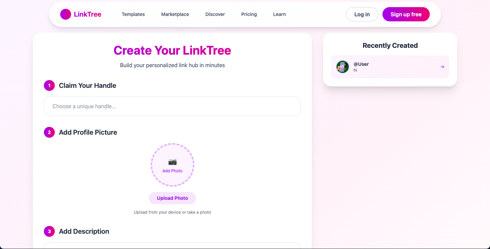
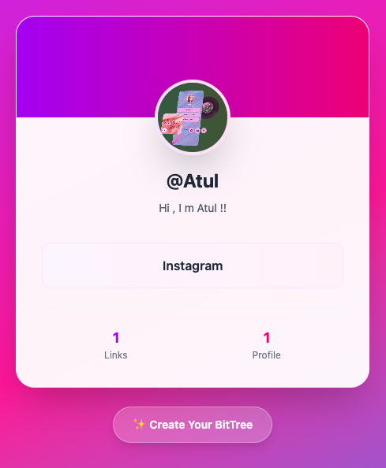

# 🌳 LinkTree - Your Personalized Link Hub

## ✨ Overview

LinkTree is a modern, beautiful **link-in-bio platform** that allows creators, entrepreneurs, and professionals to share all their important links through a single, customizable hub. Create your personalized LinkTree and connect your audience with everything that matters in one place.

> 🚀 **Perfect for**: Influencers • Entrepreneurs • Content Creators • Small Businesses • Professionals

---

## 🎯 Features

### ⚡ **Lightning Fast**
- Create your link hub in **seconds**
- Intuitive drag-and-drop interface
- No technical skills required

### 🎨 **Beautiful Design**
- **Professionally designed** templates
- **Mobile-optimized** for all devices
- **Customizable** colors and layouts

### 🔗 **Easy Sharing**
- **One simple link** for all your content
- **Analytics** to track engagement
- **Instant updates** - no app download needed

### 🛡️ **Reliable & Secure**
- 99.9% Uptime guarantee
- Secure HTTPS encryption
- Regular backups

---

## 🚀 Quick Start

### Prerequisites
- Node.js 18+ 
- npm or yarn
- Modern web browser

